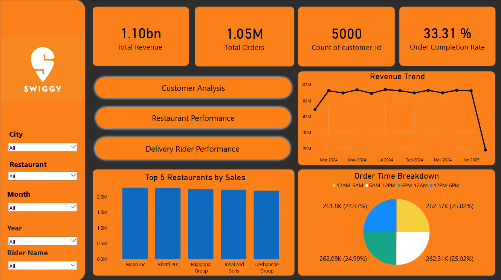
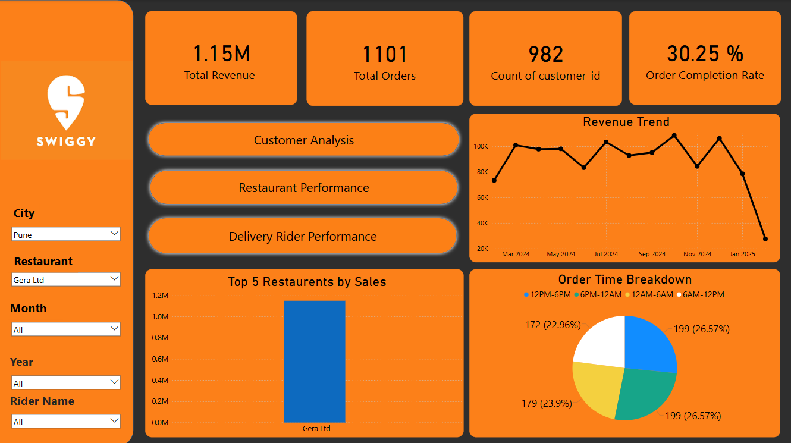
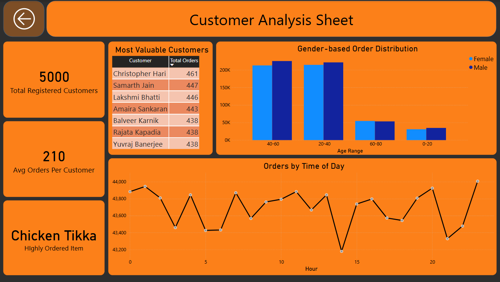
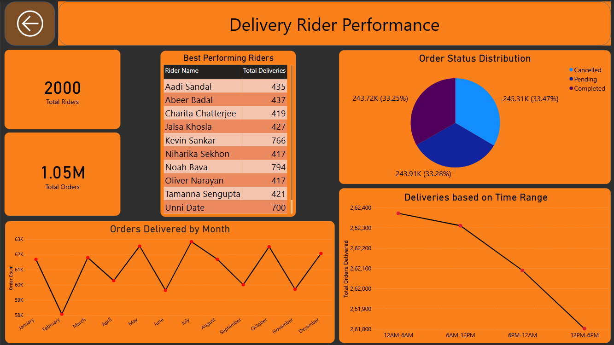
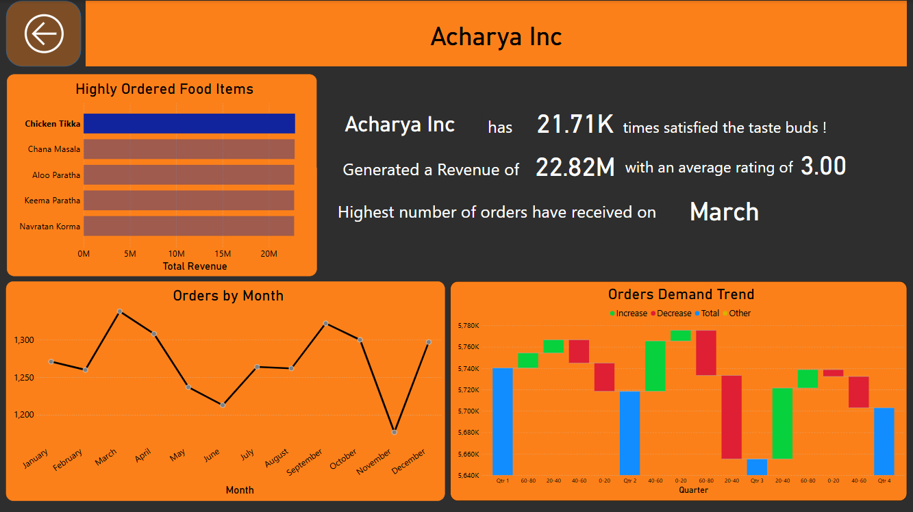

# Swiggy-Sales-Dashboard-Using-PowerBI

 

 

 The project has been performed in MySQL to analyze Swiggy's sales data, revealing insights into total orders, revenue, top selling item based on age group, location and driver performance and order distribution by time. MS Excel has been used to clean, filter and modify data as per needs. The data is presented in the form of Report or Dashboard in Power BI, which helps to keep an eye on KPIs, restaurant performances, customer analysis, etc. based on different filters.

 

## Schema
### 1. Customers

| Column            | Description                                   | Data Type  |
|-------------------|-----------------------------------------------|------------|
| customer_id       | Unique Identifier for Customers               | INT        |
| customer_name     | Name of the Customer                          | TEXT       |
| age               | Age of Customer                               | INT        |
| gender            | Gender of Customer                            | TEXT       |
| registration_date | Date of Order Booking                         | DATETIME   |

 

### 2. Deliveries

| Column            | Description                                    | Data Type  |
|-------------------|------------------------------------------------|------------|
| delivery_id       | Unique Identifier of Delivery                  | INT        |
| order_id          | Unique Identifier of Order                     | INT        |
| delivery_status   | Status of Delivery (Delivered, Failed, Transit)| TEXT       |
| delivery_time     | Time of Delivery                               | DATETIME   |
| rider_id          | Unique Identifier of Rider                     | INT        |

 

### 3. Orders

| Column            | Description                                   | Data Type  |
|-------------------|-----------------------------------------------|------------|
| order_id          | Unique Identifier of Orders                   | INT        |
| customer_id       | Unique Identifier of Customer                 | INT        |
| restaurant_id     | Unique Identifier of Restaurant               | INT        |
| order_item        | Food Item Name                                | TEXT       |
| order_time        | Time of Order                                 | DATETIME   |
| order_status      | Status of Order                               | TEXT       |
| total_amount      | Total Amount of the Order                     | FLOAT      |
| order_rating      | Order Rating                                  | INT        |

 

### 4. Restaurants

| Column            | Description                                   | Data Type  |
|-------------------|-----------------------------------------------|------------|
| restaurant_id     | Unique Identifier of Restaurant               | INT        |
| restaurant_name   | Name of the Restaurant                        | TEXT       |
| city              | Name of the City                              | TEXT       |
| opening_hours     | Restaurant open timings                       | TEXT       |

 

### 5. Riders

| Column            | Description                                   | Data Type  |
|-------------------|-----------------------------------------------|------------|
| rider_id          | Unique Identifier of Rider                    | INT        |
| rider_name        | Name of the Rider                             | TEXT       |
| sign_up           | Date of Sign up                               | DATETIME   |

 

## Approach Used
***1.	Data Wrangling***

- Built a database
- Create a table and insert the data.

 

***2.	Feature Engineering***

This will help use generate some new columns from existing ones.
- Add a new column named age_range in Customers to give insight of age distribution. This will help answer the question about item and restaurant mostly preferred by particular age group.
- Add a new column named range that contains the time range when the order was delivered. This will help answer to analyze the pattern of when and which items are mostly ordered in different hours of day.

 

# Pizza Shop Dashboard

 

## 1. Main Page

 

## 2. Main Page for a specific restaurant in Pune 

 

## 3. Customer Analysis

 

### 4. Delivery Rider Performance

 

### 5. Restaurant Performance

 

## Author
### Tushar Mukherjee 

<a href="mailto: mukherjeetushar78@gmail.com">E-mail</a> || <a href="https://www.linkedin.com/in/tushar-mukherjee-b8516028a">LinkedIn</a> || <a href="https://github.com/GocoVoid">GitHub</a>
